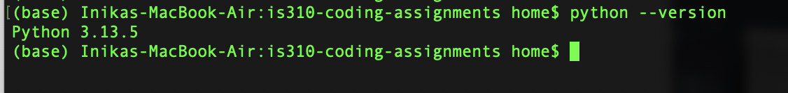
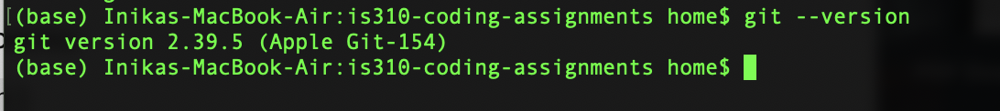
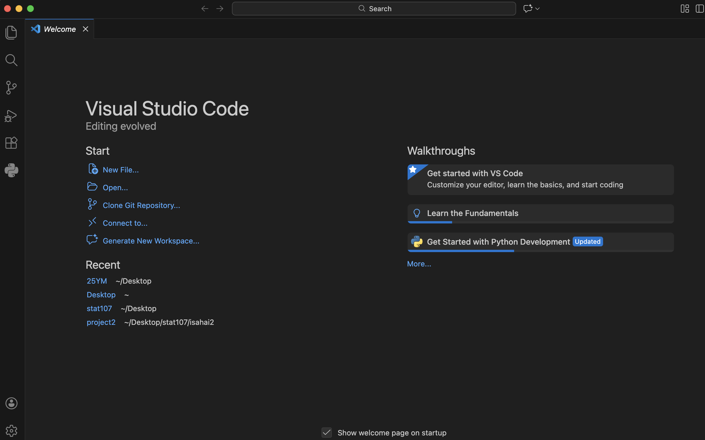
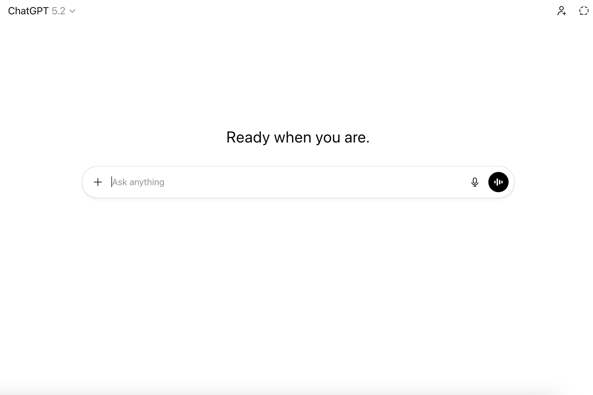

# Init IS310 Homework

## Proof of Installation

1. Python

2. Git

3. VS Code

4. AI Tool/Workflow

**AI tool I plan to use:** ChatGPT 

**How I’ll use it:** Mostly for brainstorming and debugging, especially help with explaining errors in my code.

**Hypothesis username:** inika.sahai

